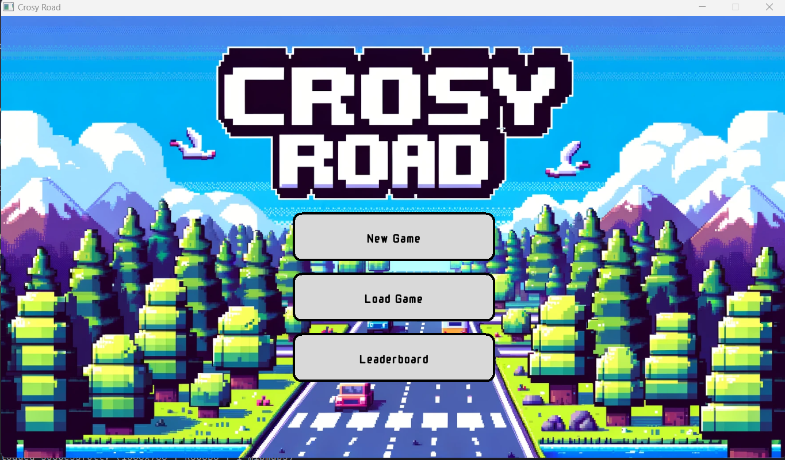
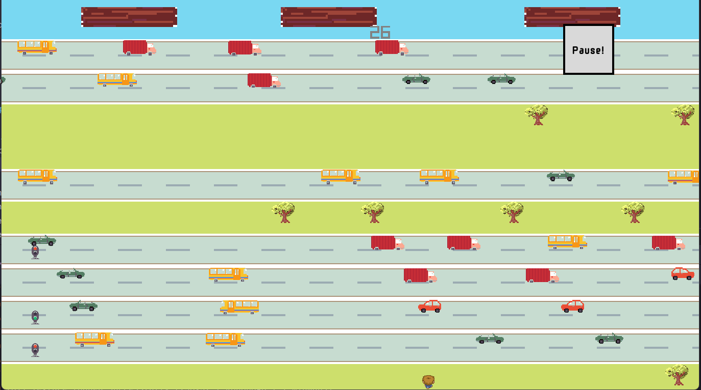
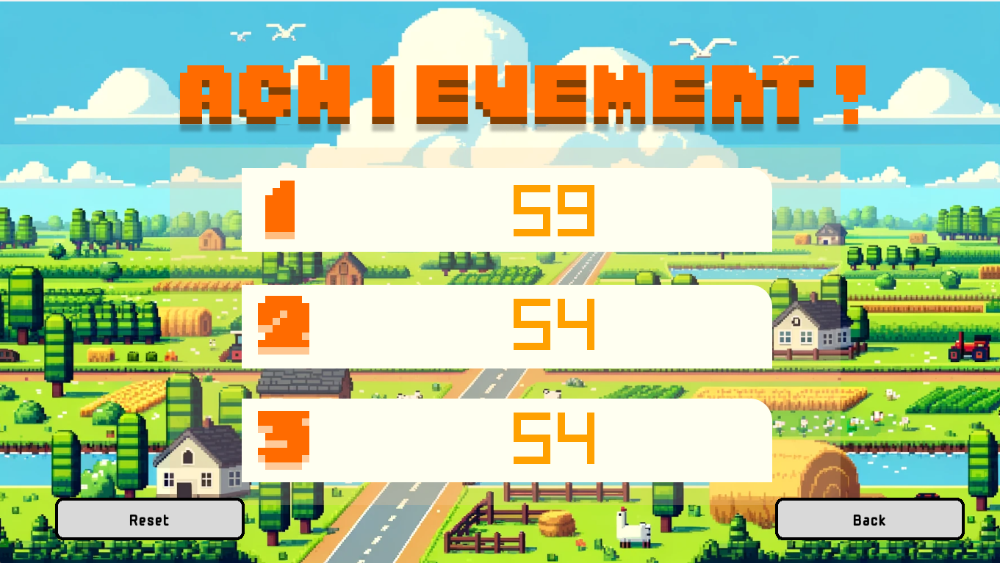

# Crossing Road - CS202 Project

## How to run

### Pre-requisites

- C++ 17 – GNU GCC 7.3.0+
    - For Windows users, please follow [this instruction](https://www.msys2.org/#installation) to install.
        - **Note**: Please install the `MinGW 64-bit` version. At step 6, please run the following command instead:
            - `pacman -S mingw-w64-x86_64-gcc`
    - For Debian users, run the following command:
        - `sudo apt-get update && sudo apt-get install build-essential`
    - For Mac users, run the following command:
        - `xcode-select --install`
- [CMake 3.26+](https://cmake.org/download/)
- Makefile
    - For Windows users, please open the `MSYS2 MinGW 64-bit` terminal and run the following command:
        - `pacman -S make`
    - For Debian users, run the following command:
        - `sudo apt-get install make`
    - For Mac users, `make` is already installed when you run the above command.
- SFML 2.5+
    - For Windows users, please open the `MSYS2 MinGW 64-bit` terminal and run the following command:
        - `pacman -S mingw-w64-x86_64-sfml`
    - For Debian users, run the following command:
        - `sudo apt-get install libsfml-dev`
    - For Mac users, please follow [this instructions](https://www.sfml-dev.org/tutorials/2.5/start-osx.php#installing-sfml) to install.
- [Doxygen](https://www.doxygen.nl/download.html) (optional) – for generating documentation

### Build

- Clone this repository
- Run the following commands:
    - `cd CS202_CrossingRoad`
    - Build the project:
        - for Windows users:
            - `cmake -G"MSYS Makefiles" -S . -B build`
        - for Debian and Mac users:
            - `cmake -S . -B build`
    - `make -C build`
- The executable file will be in the `build` folder

### Run

- Click on the executable file in the folder `build` to run the program.
- If you want to run the program in the terminal, run the following command:
    - `cd build && ./crossing_road`

## How to play

- The program will show this screen when it starts. Press New Game to play.



- The main screen will be like this: you can use WASD to move around or Arrow keys



- Leaderboard screen



## Project Structure

### Observer Design Pattern

In this project, we utilize the observer design pattern [Observer pattern - Wikipedia](https://en.wikipedia.org/wiki/Observer_pattern)

**`IObserver`**

1. Class Description: observer that listens to messages from `ISubject`
2. Main function: update according to the message passed to the observer

```cpp
virtual void updateMessage(const Message message) ;
```

**`ISubject`**

1. Class Description: the subject that notifies the observers it is attached to, messages based on events. 
2. Main functions:

```cpp
virtual void Attach(IObserver *observer) = 0; // Attach an observer to the subject
virtual void Detach(IObserver *observer) = 0; // Detach an observer from the subject
virtual void Notify(Message message) = 0; // Notify the observer with message
```

**`Messages`**

There are 4 kinds of messages

```cpp
enum class Message {
    BLOCK_OUT_OF_SCREEN,
    COLLISION,
    PAUSE_GAME,
    NEW_GAME, 
};
```

`BLOCK_OUT_OF_SCREEN`: when a block is out of the screen, this could be a map block, an animal, a vehicle obstacle, etc

`COLLISION`: When the main character collides with the object.

`PAUSE_GAME`: When the game is paused

`NEW_GAME`: When the user loads a new game.  

### Game Objects

**`BaseGameObject`:**

1. Class Description: the base class for all game objects, including the main character, obstacles, trees, and other map elements. This class inherits from the `ISubject` class
2. Main Attributes:
    1. Positions: `x`, `y` coordinates
    2. List of observers: 
    
    ```cpp
     list<IObserver *> list_observer_
    ```
    
3. Main Functions:
    1. game-related functions: `draw(), handleInput(), pauseGame()`
    2. position functions:  
    
    ```cpp
    getX(), getY() 
    ```
    
    1. save and load function: 
    
    ```cpp
    json fromJson();
    void toJson();
    string getClassName();
    ```
    

**`Obstacle`:**

1. Class diagram: the base class for obstacles on roads, rivers and non-roads including cars, trees, boats and animals
2. Main attributes:
    1. Positions: `x`, `y` coordinates
    2. List of observers
    3. Direction
    4. Width, height
    5. Boolean: `isMoving`
    6. Weather theme
    
3. Main functions: 
    - game-related functions: inherited from base game object
    
    ```cpp
    void draw();
    void handleInput();
    void pauseGame();		
    ```
    
    - Collision-related functions:
    
    ```cpp
    virtual void handleCollision();
    virtual void handleBlockMove();
    bool checkCollison();
    ```
    
    - Size functions:
    
    ```cpp
    int getWidth() const;
    int getHeight() const;
    ```
    

**`Animal`:**

1. Class Description: `Animal` class which inherits from `Obstacle` class, when the main character collides with the animal, the main character will be pushed towards the end of the screen. 
2. Main functions: 
    
    ```cpp
    void handleBlockMove();
    ```
    

**`Boat`:**

1. Class Descriptions: The wood piece that the main character can step on to get over the river. 
2. Main functions:

```cpp
void handleCollision()
```

To handle the collision with the main character. When the boat collides with the main character, it will move the main towards the end of the screen. 

## Game Screens

### State design pattern

In this project, the state design pattern [State pattern - Wikipedia](https://en.wikipedia.org/wiki/State_pattern) is used to manage game screens. Specifically 

**`ScreenManager`**

1. In each screen, it has a pointer screen manager to update the state of current screen.
2. Screen manager is used to manage the current screen including drawing it to display also updating and handling events of the current screen.

**`BaseScreen`**

1. Class description: the base game screen for all the game screens.
2. Main functions:

```cpp
virtual void handleInput() = 0; // handle the input from user
virtual void update() = 0; // update the attributes based on user input
virtual void draw() = 0; // draw the screen. 
void setScreenManager(ScreenManager *screenManager);
```

## Singleton Pattern

We utilize singleton patterns [Singleton pattern - Wikipedia](https://en.wikipedia.org/wiki/Singleton_pattern) for 2 main purposes:

- Load global sprite object to avoid loading texture multiple times
- Load global configuration variables from the config file.

# Documentation

- Here is the documentation in our project. [[link](https://diriimq.github.io/CS202_CrossingRoad/)]